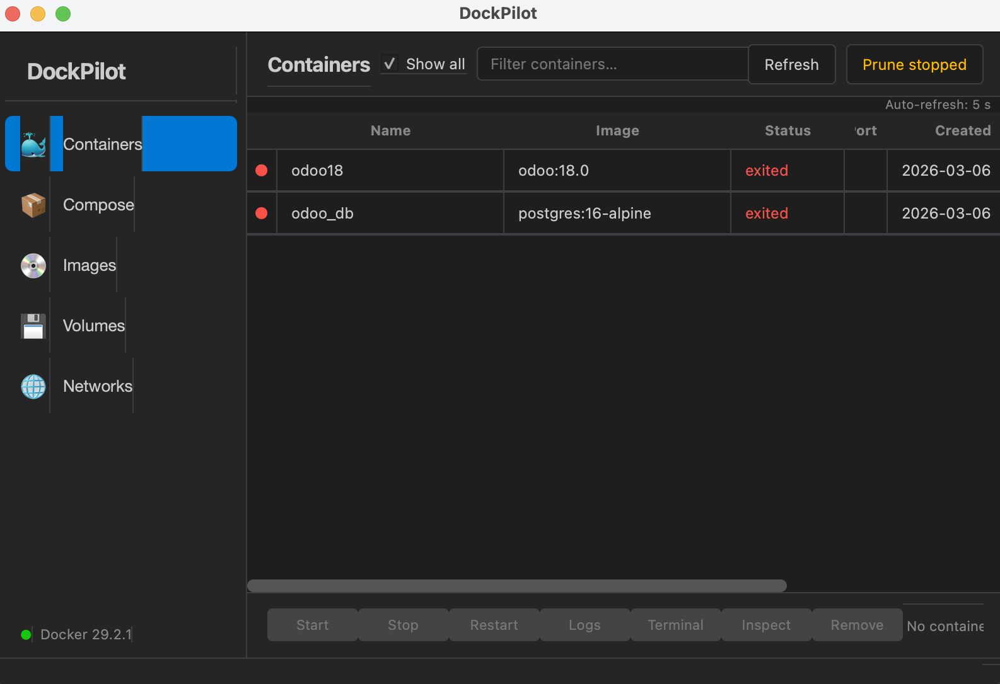

# DockPilot

A lightweight Docker Desktop replacement built with Python + PyQt6.
Manage containers, images, volumes and networks through a clean native GUI — no Electron, no account required.



---

## Features

- **Containers** — list all containers with live status, start / stop / restart / pause / remove
- **Compose** — containers grouped by `docker-compose` project with per-group actions
- **Images** — browse, pull, remove, prune dangling images
- **Volumes** — create, inspect, remove, prune
- **Networks** — create, inspect, remove, prune
- **Logs** — streaming log viewer with search and follow mode
- **Terminal** — interactive shell inside any running container (`docker exec -it`)
- **Stats** — live CPU, memory and network sparkline graphs
- **Inspect** — JSON viewer with syntax highlighting for any resource
- **Colima auto-start** — starts the Colima VM automatically on launch and stops it on quit

---

## Requirements

- macOS (tested on macOS 14+)
- Python 3.10+
- [Colima](https://github.com/abiosoft/colima) — lightweight Docker VM (replaces Docker Desktop)
- Docker CLI

---

## Setup

### 1. Install dependencies

```sh
brew install colima docker
```

### 2. Configure your shell

Add the Docker socket to your shell so the `docker` CLI and `docker compose` work in every terminal:

```sh
echo 'export DOCKER_HOST="unix://${HOME}/.colima/default/docker.sock"' >> ~/.zshrc
source ~/.zshrc
```

For bash users:

```sh
echo 'export DOCKER_HOST="unix://${HOME}/.colima/default/docker.sock"' >> ~/.bashrc
source ~/.bashrc
```

### 3. Clone and install Python dependencies

```sh
git clone https://github.com/yourusername/dockpilot.git
cd dockpilot
python3 -m venv .venv
source .venv/bin/activate
pip install -r requirements.txt
```

### 4. Run

```sh
python3 main.py
```

DockPilot will automatically start Colima on launch and stop it when you quit.

---

## How it works

On macOS, Docker always needs a Linux VM to run containers. DockPilot uses **Colima** as the VM engine — it is lighter than Docker Desktop (no Electron UI, no account, ~no background services). DockPilot itself is the GUI layer on top.

```
macOS → Colima VM → dockerd → Docker SDK (Python) → DockPilot GUI
```

If Colima is not running when DockPilot opens, it starts it automatically.
When DockPilot is closed, it stops the VM.

---

## Tech stack

| Layer | Library |
|-------|---------|
| GUI | PyQt6 |
| Docker API | docker-py (Docker SDK for Python) |
| Terminal emulation | pyte |
| VM | Colima (Lima-based) |

---

## Project structure

```
dockpilot/
├── main.py                         Entry point, sets DOCKER_HOST env var
├── requirements.txt
└── src/
    ├── app.py                      QApplication + dark theme
    ├── docker_client.py            Docker SDK wrapper (auto-detects Colima socket)
    ├── workers/
    │   ├── action_worker.py        Generic one-shot async worker
    │   ├── colima_worker.py        Colima start/stop QThread workers
    │   ├── logs_worker.py          Streaming log worker
    │   ├── pull_worker.py          Image pull with progress
    │   └── stats_worker.py         Live container stats
    └── ui/
        ├── main_window.py          Main window + sidebar + Colima lifecycle
        ├── containers_panel.py     Container list and actions
        ├── compose_panel.py        Docker Compose project groups
        ├── images_panel.py         Image management
        ├── volumes_panel.py        Volume management
        ├── networks_panel.py       Network management
        ├── logs_dialog.py          Streaming log viewer
        ├── terminal_widget.py      Interactive container terminal
        ├── stats_widget.py         Live stats graphs
        ├── inspect_dialog.py       JSON inspector
        └── pull_dialog.py          Pull image dialog
```

---

## License

MIT
