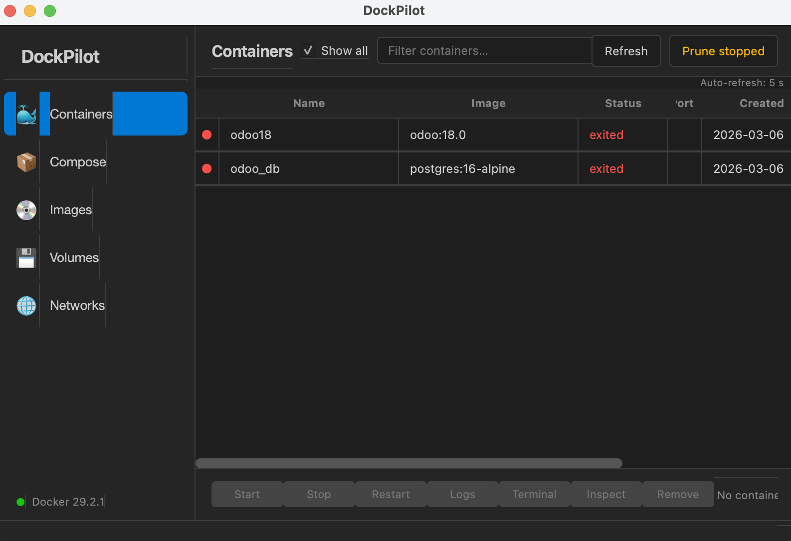

# DockPilot

A lightweight Docker Desktop replacement built with Python + PyQt6.
Manage containers, images, volumes and networks through a clean native GUI — no Electron, no account required.
Works on **macOS** (via Colima) and **Linux** (native Docker daemon).



---

## Features

- **Containers** — list all containers with live status dot, ID, ports; start / stop / restart / pause / remove
- **Rename** — right-click any container → Rename… to give it a new name
- **Restart policy** — right-click any container → Restart Policy to set Do Not Restart / Always / Always Unless Stopped / On Failure (with a max-retry count)
- **Memory limits** — right-click any container → Set Memory Limit to cap RAM usage (e.g. `256m`, `1g`, `2g`)
- **Compose** — containers grouped by `docker-compose` project with per-group actions
- **Images** — browse, pull, remove, prune dangling images
- **Volumes** — create, inspect, remove, prune
- **Networks** — create, inspect, remove, prune
- **Logs** — streaming log viewer with search and follow mode
- **Terminal** — interactive shell inside any running container with Tab autocomplete and block cursor
- **Stats** — live CPU, memory and network sparkline graphs
- **Inspect** — JSON viewer with syntax highlighting for any resource
- **Menu-bar tray icon** — Show DockPilot / Preferences / Open at Login / Quit, without keeping a Dock window open; closing the main window hides it to the tray instead of quitting so Colima keeps running in the background
- **Open at Login** — toggle from the tray menu; backed by a macOS LaunchAgent or Linux XDG autostart entry
- **Terminal CLI** — manage containers, images, volumes and networks from the shell (`dockpilot ps`, `dockpilot rename …`, `dockpilot restart-policy …`, and more — see [CLI commands](#cli-commands) below)
- **Colima lifecycle** *(macOS)* — auto-starts Colima on launch; on quit prompts to stop or keep Docker running
- **Headless mode** *(macOS)* — start or stop Colima from the terminal without opening the GUI (`-d` / `-s`)
- **Linux support** — connects directly to the Docker daemon; no Colima required
- **Icon themes** *(Linux)* — Preferences button in sidebar lets you pick any installed XDG icon theme (Papirus, Adwaita, Breeze, Numix, etc.); sidebar uses system icons automatically on Linux, emoji on macOS

---

## Installation

The fastest way to install DockPilot — no manual virtualenv, no `python3 main.py`.

### macOS

```sh
curl -sSL https://raw.githubusercontent.com/georgegozal/dockpilot/main/install.sh | bash
```

The installer requires [Homebrew](https://brew.sh) (it installs Homebrew itself if missing) and uses it to install Colima, the Docker CLI, and `docker-compose` — no manual `brew install` step needed first.

### Linux

Make sure Docker Engine is installed and your user is in the `docker` group (see [Requirements](#requirements) below), then:
```sh
curl -sSL https://raw.githubusercontent.com/georgegozal/dockpilot/main/install.sh | bash
```

The installer creates a `dockpilot` command in `~/.local/bin/` and (on Linux) a `.desktop` entry so DockPilot appears in your application menu.

### Updating

Re-run the installer at any time — it pulls the latest code and reinstalls dependencies:
```sh
curl -sSL https://raw.githubusercontent.com/georgegozal/dockpilot/main/install.sh | bash
```

### Uninstalling

```sh
curl -sSL https://raw.githubusercontent.com/georgegozal/dockpilot/main/uninstall.sh | bash
```

---

## Requirements

### macOS
- macOS 14+
- Python 3.10+
- [Homebrew](https://brew.sh) — required by `install.sh` to install the items below (installed automatically if missing)
- [Colima](https://github.com/abiosoft/colima) — lightweight Docker VM (replaces Docker Desktop)
- Docker CLI + `docker-compose` (`brew install colima docker docker-compose`)

### Linux
- Python 3.10+
- Docker Engine installed and running (`sudo apt install docker.io` or equivalent)
- Your user in the `docker` group: `sudo usermod -aG docker $USER`

---

## Development setup

For contributing or running from source without the installer.

### Clone and install Python dependencies

```sh
git clone https://github.com/georgegozal/dockpilot.git
cd dockpilot
python3 -m venv .venv
source .venv/bin/activate
pip install -r requirements.txt
```

### macOS

1. Install Colima, the Docker CLI, and `docker-compose`:
   ```sh
   brew install colima docker docker-compose
   ln -sf "$(brew --prefix docker-compose)/bin/docker-compose" ~/.docker/cli-plugins/docker-compose
   ```
   The `ln` step is required — Homebrew's `docker-compose` formula doesn't wire itself up as a `docker compose` CLI plugin on its own.
2. *(Optional)* Add the Docker socket to your shell config so the `docker` CLI works in every new terminal.

   **zsh** (default on macOS):
   ```sh
   echo 'export DOCKER_HOST="unix://${HOME}/.colima/default/docker.sock"' >> ~/.zshrc && source ~/.zshrc
   ```
   **bash:**
   ```sh
   echo 'export DOCKER_HOST="unix://${HOME}/.colima/default/docker.sock"' >> ~/.bashrc && source ~/.bashrc
   ```
3. Run DockPilot — it starts Colima automatically on launch. When you quit, it asks whether to stop Docker or keep it running in the background:
   ```sh
   python3 main.py
   ```

### Linux

1. Install Docker Engine (if not already installed):
   ```sh
   sudo apt install docker.io     # Debian / Ubuntu
   # or: sudo dnf install docker  # Fedora / RHEL
   ```
2. Add your user to the `docker` group (log out and back in after):
   ```sh
   sudo usermod -aG docker $USER
   ```
3. Run DockPilot — it connects to the running Docker daemon automatically:
   ```sh
   python3 main.py
   ```

---

## CLI flags

| Flag | Alias | Description |
|------|-------|-------------|
| `-h` | `--help` | Show usage and available options |
| `-u` | `--upgrade` | Update DockPilot to the latest version |
| `-d` | `--headless` | Start Docker (Colima) in the background, no GUI *(macOS only)* |
| `-s` | `--stop` | Stop Docker (Colima) from the terminal *(macOS only)* |

```sh
dockpilot --help
dockpilot --upgrade
dockpilot -d   # macOS: start Docker in background
dockpilot -s   # macOS: stop Docker
dockpilot      # open the GUI
```

---

## CLI commands

Manage containers, images, volumes and networks from the terminal — no GUI needed.
A container `<ref>` can be a name or an ID (or a unique prefix of either); an unrecognized
`<ref>` falls back to a substring match on container names and reports an error if that's ambiguous.

| Command | Description |
|---------|-------------|
| `dockpilot ps [-a]` | List containers (running only by default, `-a` for all) |
| `dockpilot start <ref>` | Start a container |
| `dockpilot stop <ref> [-t SECS]` | Stop a container |
| `dockpilot restart <ref> [-t SECS]` | Restart a container |
| `dockpilot rm <ref> [-f]` | Remove a container (`-f` to force-remove a running one) |
| `dockpilot rename <ref> <new_name>` | Rename a container |
| `dockpilot restart-policy <ref> <policy> [--max-retry N]` | Set restart policy: `no`, `always`, `unless-stopped`, `on-failure` |
| `dockpilot mem <ref> <limit>` | Set a memory limit (e.g. `256m`, `1g`); `0` removes it |
| `dockpilot logs <ref> [--tail N] [-f]` | Show container logs, optionally following |
| `dockpilot stats <ref>` | One-shot CPU / memory / network / block I/O snapshot |
| `dockpilot inspect <ref> [--type container\|image\|volume\|network]` | Raw JSON inspect |
| `dockpilot images [-a]` | List images |
| `dockpilot pull <image>[:tag]` | Pull an image |
| `dockpilot rmi <ref> [-f]` | Remove an image |
| `dockpilot volumes` | List volumes |
| `dockpilot networks` | List networks |
| `dockpilot prune [--images\|--volumes\|--networks\|--all] [-y]` | Remove unused containers/images/volumes/networks |
| `dockpilot status` | Docker daemon connectivity + Colima state |

Run `dockpilot <command> -h` for a command's exact options.

```sh
dockpilot ps -a
dockpilot rename web-old web-new
dockpilot restart-policy web unless-stopped
dockpilot restart-policy web on-failure --max-retry 5
dockpilot mem web 512m
dockpilot logs web -f
dockpilot prune --all -y
```

---

## How it works

On macOS, Docker always needs a Linux VM to run containers. DockPilot uses **Colima** as the VM engine — it is lighter than Docker Desktop (no Electron UI, no account, ~no background services). DockPilot itself is the GUI layer on top.

```
macOS → Colima VM → dockerd → Docker SDK (Python) → DockPilot GUI
```

If Colima is not running when DockPilot opens, it starts it automatically.
When you close DockPilot, a dialog lets you choose to stop Docker or leave it running in the background.

---

## Tech stack

| Layer | Library |
|-------|---------|
| GUI | PyQt6 |
| Docker API | docker-py (Docker SDK for Python) |
| Terminal emulation | pyte |
| VM | Colima (Lima-based) |

---

## Project structure

```
dockpilot/
├── main.py                         Entry point: CLI flags, subcommand dispatch, sets DOCKER_HOST env var
├── requirements.txt
├── install.sh                      One-script installer (macOS + Linux)
├── uninstall.sh                    Removes install dir, launcher, desktop file
├── assets/
│   └── screenshot.png
└── src/
    ├── app.py                      QApplication + dark theme + tray icon setup
    ├── docker_client.py            Docker SDK wrapper (auto-detects Colima socket)
    ├── login_item.py               "Open at Login" — macOS LaunchAgent / Linux XDG autostart
    ├── cli/
    │   ├── app.py                  argparse subcommand parser + dispatch
    │   └── commands.py             `dockpilot ps/start/rename/restart-policy/...` implementations
    ├── workers/
    │   ├── action_worker.py        Generic one-shot async worker + FetchWorker (non-blocking polls)
    │   ├── colima_worker.py        Colima start/stop QThread workers (macOS only)
    │   ├── logs_worker.py          Streaming log worker
    │   ├── pull_worker.py          Image pull with progress
    │   └── stats_worker.py         Live container stats
    └── ui/
        ├── main_window.py          Main window + sidebar + Colima lifecycle/quit dialog (macOS only)
        ├── tray_icon.py            Menu-bar icon: Show / Preferences / Open at Login / Quit
        ├── containers_panel.py     Container list and actions (start/stop/rename/restart policy/mem limit)
        ├── compose_panel.py        Docker Compose project groups
        ├── images_panel.py         Image management
        ├── volumes_panel.py        Volume management
        ├── networks_panel.py       Network management
        ├── logs_dialog.py          Streaming log viewer
        ├── terminal_widget.py      Interactive container terminal
        ├── stats_widget.py         Live stats graphs
        ├── inspect_dialog.py       JSON inspector
        ├── preferences_dialog.py   Preferences dialog (icon theme — Linux only)
        └── pull_dialog.py          Pull image dialog
```

---

## License

GNU Affero General Public License v3.0 — see [LICENSE](LICENSE) for details.
